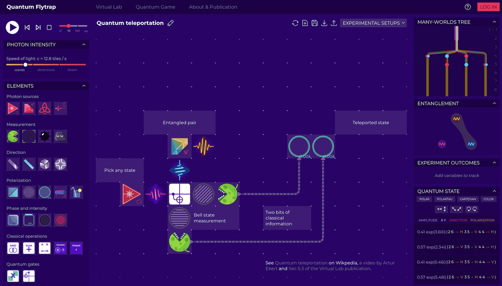

The traditional way of teaching includes textbooks, lectures, and projects. This teaching method is performed top-down, with clear instructions and expectations. Students are tested via grading of projects, homework assignments, and exams. Usually fun, or the ability to explore on one's own, is not the key focus. Often students' motivation is extrinsic — to pass a course with a good grade. These activities can be gamified, provided with supplementary goals, scores, and challenges to make them more engaging.

::gallery{ width=2 }

#caption
[Velocity Raptor](https://testtubegames.com/velocityraptor.html) by Test Tube Games and [HyperRogue](https://roguetemple.com/z/hyper/) by Zeno Rogue.
::

In contrast, **science-based games**[^29] approach teaching from the opposite direction: to primarily focus on creating an experience sparking intrinsic motivation,[^89] that is, students play for fun, but learn in the process, as their gaming experience requires learning concepts to proceed or provides an explorative pathway through the game that promotes learning[^90] (even if it is not strictly necessary).

There are several existing games showing different aspects of physics—special relativity theory,[^91] electromagnetism,[^92] classical physics, and orbital mechanics.[^93] There are games that teach computing—creating circuits from the simplest blocks—NAND gates[^94] and low-level programming in assembly. Although a lot of games are standalone one-off projects, some game developers specialize in science-based games, e.g., Zachtronics (algorithmics) and Test Tube Games (physics). Some science-based games go way beyond the niche – SpaceChem and Kerbal Space Program sold over 1 million and over 2 million copies on Steam,[^95] respectively.

**Explorable explanations**[^96] (or "explorables") come at educational games from the opposite direction: instead of "games, but with sc ience communication added," they are "science communication, but with interactivity added," although we should note that interactivity is a necessary but not sufficient condition for something to be considered a game. Most explorables are educational articles, with embedded simulations instead of static media such as images and videos. The term "explorable explanation" was coined in 2011 by interaction designer Bret Victor,[^97] with an ambitious goal of creating a two-way communication between the author and the reader. With an open-ended creative environment, readers can challenge the author's assumptions by going beyond what the author ever imagined. This ambition is explained more in the 2019 essay[^98] by former Khan Academy designer Andy Matuschak and quantum physicist Michael Nielsen. These approaches are tightly related to exploring new visual languages of communication.

**Figure** A self-descriptive formula of the discrete Fourier transform: a web-based MathJax implementation[^99] of an equation color-coding scheme designed by Stuart Riffle from 2011.[^100] Earlier approaches of color-coding go back to the Byrne's Euclid from 1847[^101] subtitled "In which Coloured Diagrams and Symbols are Used Instead of Letters for the Greater Ease of Learners."

Deep learning shares many similar concepts with quantum technologies - both hyped, fast-growing technologies, are heavily based on linear algebra with tensor products and have a nontrivial entry barrier. The abundance of online tools that help users to learn and directly use deep learning already gets traction in gaming[^102] and can provide guidance on how to present quantum technologies in an accessible, ready-to-use way. There are already numerous explorable explanations in machine learning and AI,[^103] including general introductions to probability and statistics,[^104] decision trees and validation in machine learning,[^105] training of artificial neural network classifiers,[^106] and interpretability of convolutional neural networks.[^107],[^108] In 2016 to 2021, a dedicated peer-reviewed journal Distill aimed at providing interactive explanations of novel research.[^109]

Although the interactive environment of Jupyter Notebooks is a standard way of providing introductions to quantum software frameworks,[^110],[^111] there is only a handful of other quantum explorable explanations, e.g., a spaced-repetition-based introduction to quantum computing,[^112] an introduction to quantum Fourier transform,[^113] and an exploration of single-qubit gates.[^114]

John Preskill wrote that "perhaps kids who grow up playing quantum games will acquire a visceral understanding of quantum phenomena that our generation lacks",[^vl30] and studies confirm that this type of open-ended experience promotes exploration.[^vl31]

It shouldn't be surprising as children learn Newtonian physics by interacting with their environment[^vl32],[^vl33] rather than starting with differential calculus.

We designed Virtual Lab by Quantum Flytrap[^virtuallabsite] to be a highly composable environment (such as LEGO bricks or Minecraft) yet powerful enough to simulate major wave optics and quantum information phenomena. "Leave computing to computers" served as our motto.

## Notes

This is an except from [Quantum games and interactive tools for quantum technologies outreach and education](https://doi.org/10.1117/1.OE.61.8.081809),[^quantumedu] (sections 3.2 Science-based games and 3.3 Explorable Explanations) and [Visualizing quantum mechanics in an interactive simulation - Virtual Lab by Quantum Flytrap](https://doi.org/10.1117/1.OE.61.8.081808),[^virtuallab] open-access articles I co-authored.

The motivation to develop and share such media is remarkably similar among various creators. For example the authors of [HyperRogue](https://roguetemple.com/z/hyper/)[^hyperrogue] write:

> In typical courses one would learn that, for example, the sum of angles of a hyperbolic triangle is less than 180◦, but it is not clear how this could be applicable, or what would be the effects for people living in the hyperbolic world; even in other existing hyperbolic games and VRs the world is periodic and sterile. In HyperRogue, players are led to gain intuitions about hyperbolic geometry, and to pose questions about how things known from our world would work there.

If you want to see explorables, there is no better way that [Explorable Explanations](https://explorabl.es) and [Distill Journal](https://distill.pub/). I created (though, no longer maintain) list of [Science-based games](https://github.com/stared/science-based-games-list) and an [Interactive machine learning list](https://p.migdal.pl/interactive-machine-learning-list/).

I shared it here (on the same Creative Commons CC BY license, obviously) because these sections are worth reading on their own, regardless of whether we talk about quantum mechanics and quantum computing or any other piece of science and engineering. I sincerely believe we can change the fundamental teaching and learning approach, making it more accessible and enjoyable.

[^29]: P. Migdał, [Science-based games](https://github.com/stared/science-based-games-list), (2017)
[^89]: J. Schell, [Art of game design](https://www.schellgames.com/art-of-game-design)
[^90]: E. Bonawitz et al., [The double-edged sword of pedagogy: Instruction limits spontaneous exploration and discovery](https://doi.org/10.1016/j.cognition.2010.10.001), Cognition, 120 (3), 322–330 (2011)
[^91]: T. L. Taylor, [A slower speed of light](http://gamelab.mit.edu/games/a-slower-speed-of-light/), (2022)
[^92]: A. Hall, [The Electric Shocktopus](http://testtubegames.com/shocktopus.html), (2015)
[^93]: [Kerbal space program – create and manage your own space program](https://www.kerbalspaceprogram.com/), (2022)
[^94]: O. J. Kjær, [NandGame – build a computer from scratch](https://nandgame.com/about)
[^95]: [Games sales SteamSpy – all the data about steam games](https://steamspy.com)
[^96]: N. Case, [Explorable Explanations](https://github.com/explorableexplanations/explorableexplanations.github.io), (2022)
[^97]: B. Victor, [Explorable Explanations](http://worrydream.com/ExplorableExplanations)
[^98]: A. Matuschak and M. Nielsen, [How can we develop transformative tools for thought?](https://numinous.productions/ttft/), (2018)
[^99]: M. Adereth, [Colorful equations with MathJax](https://adereth.github.io/blog/2013/11/29/colorful-equations), (2013)
[^100]: S. Riffle, [Understanding the Fourier transform](https://web.archive.org/web/20130318211259/http://www.altdevblogaday.com/2011/05/17/understanding-the-fourier-transform), (2011)
[^101]: O. Byrne, [The First Six Books of the Elements of Euclid, in Which Coloured Diagrams and Symbols are Used Instead of Letters for the Greater Ease of Learners](https://www.c82.net/euclid/), William Pickering, London (1847)
[^102]: P. Migdał, B. Olechno and B. Podgórski, [Level generation and style enhancement - deep learning for game development overview](https://arxiv.org/abs/2108.04908), arXiv:2108.04908 (2021)
[^103]: P. Migdał, [Interactive machine learning list](https://p.migdal.pl/interactive-machine-learning-list/)
[^104]: D. Kunin, [Seeing theory](http://seeingtheory.io)
[^105]: S. Yee and T. Chu, [A visual introduction to machine learning](http://www.r2d3.us/visual-intro-to-machine-learning-part-1/), (2022)
[^106]: D. Smilkov and S. Carter, [Tensorflow — neural network playground](http://playground.tensorflow.org)
[^107]: C. Olah, A. Mordvintsev and L. Schubert, [Feature visualization](https://doi.org/10.23915/distill.00007), Distill, 2 (11), (2017)
[^108]: C. Olah et al., [The building blocks of interpretability](https://doi.org/10.23915/distill.00010), Distill, 3 (3), e10 (2018)
[^109]: [Distill hiatus](https://doi.org/10.23915/distill.00031), Distill, 6 (7), e31 (2021)
[^110]: B. M. Randles et al., [Using the Jupyter notebook as a tool for open science: an empirical study](https://doi.org/10.1109/JCDL.2017.7991618), in ACM/IEEE Joint Conf. Digital Libr. (JCDL), 1 –2 (2017)
[^111]: J. M. Perkel, [Why Jupyter is data scientists' computational notebook of choice](https://doi.org/10.1038/d41586-018-07196-1), Nature, 563 (7729), 145–146 (2018)
[^112]: A. Matuschak and M. Nielsen, [Quantum country](https://quantum.country), (2019)
[^113]: C. Gidney, [Building your own quantum Fourier transform](https://algassert.com/quantum/2014/03/07/Building-your-own-Quantum-Fourier-Transform.html)
[^114]: C. Zendejas-Morales and P. Migdał, [Quantum logic gates for a single qubit, interactively](https://quantumflytrap.com/blog/2021/qubit-interactively) (2021)
[^quantumedu]: Zeki C. Seskir, Piotr Migdał, Carrie Weidner, Aditya Anupam, Nicky Case, Noah Davis, Chiara Decaroli, İlke Ercan, Caterina Foti, Paweł Gora, Klementyna Jankiewicz, Brian R. La Cour, Jorge Yago Malo, Sabrina Maniscalco, Azad Naeemi, Laurentiu Nita, Nassim Parvin, Fabio Scafirimuto, Jacob F. Sherson, Elif Surer, James R. Wootton, Lia Yeh, Olga Zabello, and Marilù Chiofalo [Quantum games and interactive tools for quantum technologies outreach and education](https://doi.org/10.1117/1.OE.61.8.081809), Optical Engineering 61(8), 081809 (2022)
[^vl30]: J. Preskill, [Quantum computing in the NISQ era and beyond](https://doi.org/10.22331/q-2018-08-06-79), Quantum, 2, 79 (2018)
[^vl31]: E. Bonawitz et al., [The double-edged sword of pedagogy: Instruction limits spontaneous exploration and discovery](https://doi.org/10.1016/j.cognition.2010.10.001), Cognition, 120 (3), 322–330 (2011)
[^vl32]: J. E. Fox, [Swinging: What young children begin to learn about physics during outdoor play](https://doi.org/10.1007/BF03173764), J. Elementary Sci. Educ., 9, 1 (1997)
[^vl33]: S. L. Solis, K. N. Curtis and A. Hayes-Messinger, [Children's exploration of physical phenomena during object play](https://doi.org/10.1080/02568543.2016.1244583), J. Res. Childhood Educ., 31 (1), 122–140 (2017)
[^virtuallabsite]: [Virtual Lab by Quantum Flytrap](https://lab.quantumflytrap.com)
[^virtuallab]: Piotr Migdał, Klementyna Jankiewicz, Paweł Grabarz, Chiara Decaroli, Philippe Cochin, [Visualizing quantum mechanics in an interactive simulation - Virtual Lab by Quantum Flytrap](https://doi.org/10.1117/1.OE.61.8.081808), Optical Engineering 61(8), 081808 (2022)
[^hyperrogue]: E. Kopczynski, D. Celinska, and M. Ctrnáct [HyperRogue: Playing with Hyperbolic Geometry](https://archive.bridgesmathart.org/2017/bridges2017-9.html#gsc.tab=0), Proceedings of Bridges, 9–16 (2017)
