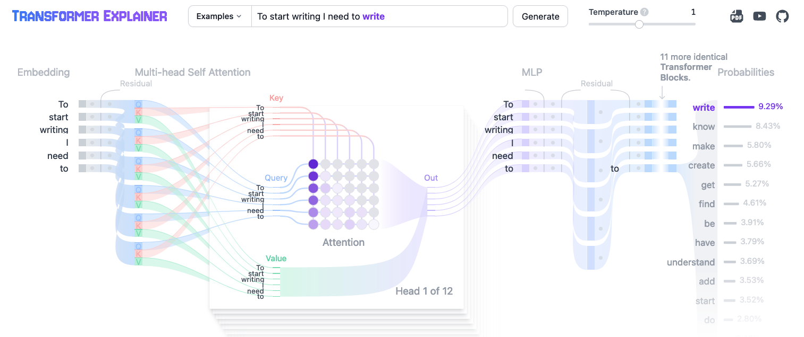

Have you ever chatted with someone who could talk for hours, only to watch them freeze up when asked to write a simple email? Writer's block doesn't discriminate — it plagues everyone from first-time bloggers to bestselling authors. But what if our AI companions could teach us a thing or two about breaking through that mental barrier?

Large Language Models (LLMs) like GPT-4 don't agonize over their next word. They generate text one token at a time, free from the chains of self-doubt and perfectionism. What if we could adopt a similar approach to our own writing? Imagine the possibilities: emails sent, novels written, grocery lists completed without existential dread.

### The fear of writing

Sometimes, silence is golden — like during a heated debate or when you're lost in deep thought. Other times, [we freeze — not because we choose silence, but because our minds blank out](https://p.migdal.pl/blog/2021/02/dont-fight-flight-or-freeze-your-body-and-emotions), like when we're unexpectedly asked to say a few words in front of a crowd.

We often treat written words as if we're carving them into stone tablets. In reality, we're just jotting notes. Paper is cheap, and keystrokes are even cheaper. Neither rushes nor judges us — there's a saying that "paper is patient." Even if you [have dangerous ideas you'd think twice before sharing](https://slatestarcodex.com/2017/10/23/kolmogorov-complicity-and-the-parable-of-lightning/), writing itself is safe.

### LLMs are Zen masters

ChatGPT, Claude, and Llama write as if no-one was judging them. These LLMs are the ultimate "go with the flow" writers. They don't overthink — they write one token at a time, without planning ahead or obsessing over edits.

::gallery{ width=1 }

#caption
From [an explorable explanation](https://p.migdal.pl/blog/2024/05/science-games-explorable-explanations), [Transformer Explainer](https://poloclub.github.io/transformer-explainer/). It predicts all possibilities of the next token, picks one, never going back.
::

It's mind-boggling that we, too, can create complex text without meticulous planning. During my first year of studies, [a professor](https://www.mimuw.edu.pl/~urzy/) called proofs a "literary form," akin to poetry with specific rules. His advice for starting a proof? Simply restate what you know and assign symbols to entities you need. Curiously, the proof often unfolded naturally from there. If a mathematical proof can be done this way, the sky's the limit for other forms of writing.

### Writing is thinking

Writing isn't just translating thoughts into words — it's an act of thinking itself. With each token, we collapse all possible ideas into a single instance and roll with it. In LLMs, there's a concept called "[chain of thought](https://youtu.be/bZQun8Y4L2A?t=1464)" — breaking down complex tasks step by step. The currently most advanced model [OpenAI o1 has this chain of thought mechanism built-in](https://openai.com/index/learning-to-reason-with-llms/).

Taking inspiration from this, we can start by simply writing down our thoughts. After all, planning is writing too. Here's a liberating truth I learned during my PhD: the first version is never the final version. There's no need to stress over perfection in your first draft — it won't be flawless no matter how hard you try. Think of it as a rough sketch, not a masterpiece.

### AI needs prompts, and so do we

LLMs need prompts, and so do we. Even the most advanced models like GPT-4 require a starting point. In complex cases, [it's sometimes simpler to create the content directly than to write a prompt](https://p.migdal.pl/blog/2023/02/ai-artists-information-theory).

My PhD co-advisor, [Javier Rodríguez-Laguna](http://mononoke.fisfun.uned.es/jrlaguna/), once recommended starting as if sharing a curiosity with a friend. This sets the right tone and focuses on simple explanations. Details and appropriate tone can always be added later in the editing process.

I took this piece of advice to heart when writing academic articles and blog posts alike. In fact, some of my most popular posts began as emails I kept forwarding—like [this intro to data science](https://p.migdal.pl/blog/2016/03/data-science-intro-for-math-phys-background).

### Planning is writing, editing is writing

Not everything pours out perfectly on the first try — unless you're an AI model with zero self-doubt. But here's the secret: planning is writing too. Scribbling down a messy outline, jotting bullet points on a napkin, or sketching ideas in the margins — it all counts. It's like laying out the puzzle pieces before you see the whole picture (except the puzzle keeps changing shape).

Editing? That's just writing in disguise. Every tweak, every rephrased sentence, every comma moved (and Oxford commas debated) is part of the writing journey. Think of editing as the art of sculpting a block of marble — you chip away until something that vaguely resembles your initial idea emerges.

So whether you're planning, drafting, or revising for the nth time, you're still writing. And that's the beauty of it — each stage brings you closer to turning thoughts into words, one token at a time.

### Let's write like AI

The next time you find yourself staring at a blank page, remember: you don't need to have it all figured out before you start. Begin with a simple statement, let your thoughts flow, and write as if you were AI — one token at a time.

You might be surprised at how quickly your writer's block dissolves and your creativity blossoms. After all, if a bunch of ones and zeros can string together coherent sentences, surely we humans can too — with a little less overthinking and a lot more flow.

Now, go forth and write like the beautiful, imperfect, token-generating human you are. Your blank page awaits!

---

I would like to thank [Grzegorz Uriasz](https://gorbak25.eu/) for his insightful feedback on the initial draft.

Stay tuned for the next post, where I'll reveal some nifty tricks for harnessing LLMs as your editorial sidekicks.
