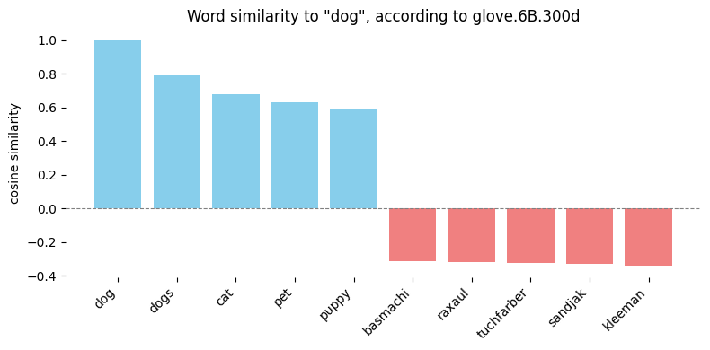
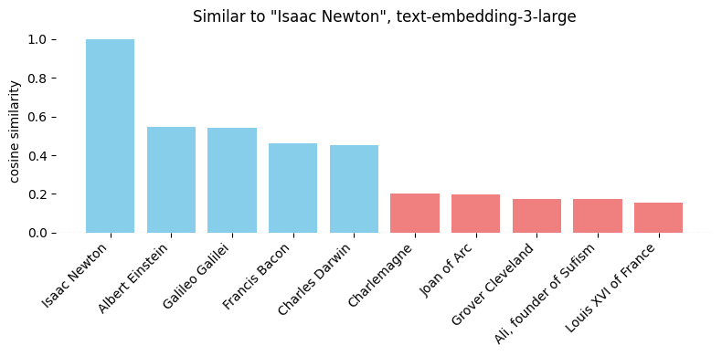
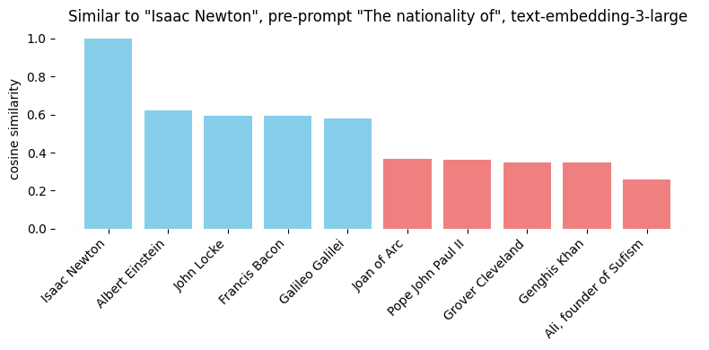

Midas turned everything he touched into gold. Data scientists turn everything into vectors.  
We do it for a reason — as gold is the language of merchants, vectors are the language of AI.

Just as Midas discovered that turning everything to gold wasn't always helpful, we'll see that blindly applying cosine similarity to vectors can lead us astray. While embeddings do capture similarities, they often reflect the wrong kind - matching questions to questions rather than questions to answers, or getting distracted by superficial patterns like writing style and typos rather than meaning. This post shows you how to be more intentional about similarity and get better results.

## Embeddings

Embeddings are so captivating that my most popular blog post remains [king - man + woman = queen; but why?](https://p.migdal.pl/blog/2017/01/king-man-woman-queen-why).
We have [word2vec](https://p.migdal.pl/blog/2017/01/king-man-woman-queen-why), [node2vec](https://snap.stanford.edu/node2vec/), [food2vec](https://jaan.io/food2vec-augmented-cooking-machine-intelligence/), [game2vec](https://github.com/warchildmd/game2vec), and if you can name it, someone has probably turned it into a vec. If not yet, it's your turn!

When we work with raw IDs, we're blind to relationships. Take the words "brother" and "sister" — to a computer, they might as well be "xkcd42" and "banana". But with vectors, we can discover relationships between them — both to provide as a structured input to a machine learning models, and on its own, to find similar items.

Let's focus on sentence embeddings from Large Language Models (LLMs), as they are one of the most popular use cases for embeddings. Modern LLMs are so powerful at this that they can capture the essence of text without any fine-tuning. In fact, recent research shows these embeddings are almost as revealing as the original text - see Morris et al., [Text Embeddings Reveal (Almost) As Much As Text](https://arxiv.org/abs/2310.06816), (2023).
Yet, with great power comes great responsibility - both in terms of how we use these powerful models and how we protect the privacy of the data we store and process.

## Example

Let's look at three sentences:

- A: _"Python can make you rich."_
- B: _"Python can make you itch."_
- C: _"Mastering Python can fill your pockets."_

If you treated them as raw IDs, there are different strings, with no notion of similarity. Using string similarity ([Levenshtein distance](https://en.wikipedia.org/wiki/Levenshtein_distance)), A and B differ by 2 characters, while A and C are 21 characters apart. Yet semantically (unless you're allergic to money), A is closer to C than B.

We can use [OpenAI text-embedding-3-large](https://platform.openai.com/docs/guides/embeddings), to get the following vectors:

- A: `[-0.003738, -0.033263, -0.017596,  0.029024, -0.015251, ...]`
- B: `[-0.066795, -0.052274, -0.015973,  0.077706,  0.044226, ...]`
- C: `[-0.011167,  0.017812, -0.018655,  0.006625,  0.018506, ...]`

These vectors are quite long - text-embedding-3-large has up 3072 dimensions - to the point that [we can truncate them at a minimal loss of quality](https://openai.com/index/new-embedding-models-and-api-updates/).
When we calculate cosine similarity, we get 0.750 between A and C (the semantically similar sentences), and 0.576 between A and B (the lexically similar ones). These numbers align with what we'd expect - the meaning matters more than spelling!

## What is cosine similarity?

When comparing vectors, there's a temptingly simple solution that every data scientist reaches for, often without a second thought — cosine similarity:

$$ \text{cosine similarity}(\vec{a}, \vec{b}) = \frac{\vec{a} \cdot \vec{b}}{\|\vec{a}\| \|\vec{b}\|} = \frac{\sum_i a_i b_i}{\sqrt{\sum_i a_i^2} \sqrt{\sum_i b_i^2}} $$

Geometrically speaking, it is the cosine of the angle between two vectors. However, I avoid thinking about it this way - we're dealing with spaces of dozens, hundreds, or thousands of dimensions. Our geometric intuition fails us in such high-dimensional spaces, and we shouldn't pretend otherwise.

From a numerical perspective, it is a dot product with normalized vectors.
It has some appealing properties:

- Identical vectors score a perfect 1.
- Random vectors hover around 0 (there are many dimensions, so it averages out).
- The result is between -1 and 1.

Yet, this simplicity is misleading. Just because the values usually fall between 0 and 1 doesn't mean they represent probabilities or any other meaningful metric. The value 0.6 tells little if we have something really similar, or not so much. And while negative values are possible, they rarely indicate semantic opposites — more often, the opposite of something is gibberish.

::gallery{ width=1 }

#caption
When using cosine similarity on [Glove vectors](https://nlp.stanford.edu/projects/glove/) (`glove.6B.300d`), the closest words to "dog" are predictable, the farthest - not
You can play with it [in Colab](https://colab.research.google.com/github/stared/thinking-in-tensors-writing-in-pytorch/blob/master/rnns/Word%20vectors.ipynb) from my [Thinking in tensors, writing in PyTorch](https://github.com/stared/thinking-in-tensors-writing-in-pytorch) series.
::

In other words, cosine similarity is the duct tape of vector comparisons. Sure, it sticks everything together — images, text, audio, code — but like real duct tape, it's a quick fix that often masks deeper problems rather than solving them. And just as you wouldn't use duct tape to permanently repair a water pipe, you shouldn't blindly trust cosine similarity for all your vector comparison needs.

Like a Greek tragedy, this blessing comes with a curse: when it works, it feels like effortless magic. But when it fails, we are clueless, and we often run into impromptu fixes, each one bringing issues on its own.

## Relation to correlation

[Pearson correlation](https://en.wikipedia.org/wiki/Pearson_correlation_coefficient) can be seen as a sequence of three operations:

1. Subtracting means to center the data.
2. Normalizing vectors to unit length.
3. Computing dot products between them.

Cosine similarity uses only steps 2 and 3 of Pearson correlation, skipping the mean centering step.
When we work with vectors that are both centered ($\sum_i v_i = 0$) and normalized ($\sum_i v_i^2 = 1$), Pearson correlation, cosine similarity and dot product are the same.

In practical cases, we don't want to center or normalize vectors during each pairwise comparison - we do it once, and **just use dot product**. In any case, when you are fine with using cosine similarity, you should be as fine with using Pearson correlation (and vice versa).

## Problems with cosine similarity as a measure of similarity

Using cosine similarity as a training objective for machine learning models is perfectly valid and mathematically sound.
As we just seen, it's a combination of two fundamental operations in deep learning: dot product and normalization.
The trouble begins when we venture beyond its comfort zone, specifically when:

- The cost function used in model training isn't cosine similarity (usually it is the case!).
- The training objective differs from what we actually care about.

### Has the model ever seen cosine similarity?

A common scenario involves training with unnormalized vectors, when we are dealing with a function of dot product - for example, predicting probabilities with [a sigmoid function](https://en.wikipedia.org/wiki/Sigmoid_function) $\sigma(v_a \cdot v_b)$ and applying log loss cost function. Other networks operate differently, e.g. they use Euclidean distance $\left\|v_a - v_b\right\|_2$, minimized if items are similar and maximized otherwise.

The normalization gives us some nice mathematical properties (keeping results between -1 and +1, regardless of dimensions), but it's ultimately a hack. Sometimes it helps, sometimes it doesn't — see the aptly titled paper [Is Cosine-Similarity of Embeddings Really About Similarity?](https://arxiv.org/abs/2403.05440).

Sure, back in the days of an image detection model VGG16 I was using logit vectors from the classification layer and Pearson correlation to find similar images. It kind of worked - being fully aware it is a hack and just a hack.

We are safe only if the model itself uses cosine similarity or a direct function of it - usually implemented as a dot product of vectors that are kept normalized. Otherwise, we use a quantity we have no control over. It may work in one instance, but not in another. If some things are extremely similar, sure, it is likely that many different measures of similarity will give similar results. But if they are not, we are in trouble.

In general, it is a part of a broader subject of unsupervised machine vs self-supervised learning.
In the first one, we take an arbitrary function and we get some notions or similarity. Yet, there is no way to evaluate it.
The second one, self-supervised learning, is a predictive model, in which we can directly evaluate the quality of prediction.

### Is it the right kind of similarity?

And here is the second issue - even if [a model is explicitly trained on cosine similarity](https://cdn.openai.com/papers/Text_and_Code_Embeddings_by_Contrastive_Pre_Training.pdf), we run into a deeper question: whose definition of similarity are we using?

Consider books. For a literary critic, similarity might mean sharing thematic elements. For a librarian, it's about genre classification. For a reader, it's about emotions it evokes. For a typesetter, it's page count and format. Each perspective is valid, yet cosine similarity smashes all these nuanced views into a single number — with confidence and an illusion of objectivity.

](./cartoon-espresso-word2vec.jpg)

In the US, word2vec might tell you espresso and cappuccino are practically identical. It is not a claim you would make in Italy.

## When it falls apart

Let's have a task that looks simple, a simple quest from our everyday life:

- _"What did I do with my keys?"_

Now, using cosine similarity, we can compare it to other notes:

- _"I left them in my pocket"_
- _"They are on the table"_
- _"Where did I put my wallet?"_
- _"What I did to my life?"_

::gallery{ width=1 }

#caption
The closest match is not a plausible answer to our question — instead, it is another question. With sentence embedding cosine similarity, we are more likely to question our own life than to solve our mundane task.
Fortunately, sentences about Python are close to zero - as they are not related.
::

And remember, this is just a toy example with five sentences. In real-world applications, we're often dealing with thousands of documents — far more than could fit in a single context window. As your dataset grows, so does the noise sensitivity, turning your similarity scores into a game of high-dimensional roulette.

## So, what can we use instead?

### The most powerful approach

The best approach is to directly use LLM query to compare two entries. So, first, start with [a powerful model of your choice](https://lmarena.ai/?leaderboard). Then, we can write something in the line of:

> "Is {sentence_a} a plausible answer to {sentence_b}?"

This way we harness the full power of an LLM to extract meaningful comparisons - powerful enough to find our keys in pockets, and wise enough to understand the difference between questions and answers.
We typically want our answers in structured output - what the field calls "tools" or "function calls" (which is really just a fancy way of saying "JSON").

Since many models love Markdown (as they were trained on it), my default template looks like this:

```markdown
{question}

## A

{sentence_a}

## B

{sentence_b}
```

However, in most cases this approach is impractical - we don't want to run such a costly operation for each query. Unless our dataset is very small, it would be prohibitively expensive. Even with a small dataset, the delays would be noticeable compared to a simple numerical operation.

### Extracting the right features

So, we can go back to using embeddings.
But instead of blindly trusting a black box, we can directly optimize for what we actually care about by creating task-specific embeddings.
There are two main approaches:

- Fine-tuning (teaching an old model new tricks by adjusting its weights).
- Transfer learning (using the model's knowledge to create new, more focused embeddings).

Which one we use is ultimately a technical question - depending on the access to the model, costs, etc.
Let's start with a symmetric case. Say we want to ask, **"Is A similar to B?"** We can write this as:

$$\sigma(u_A \cdot u_B)$$

where $u = M v$, and $M$ is a matrix that reduces the embedding space to dimensions we actually care about; and $\sigma(x)=1/(1+e^{-x})$ is the sigmoid function. Think of it as decluttering — we're keeping only the features relevant to our specific similarity definition.

But often, similarity isn't what we're really after. Consider the question **"Is document B a correct answer to question A?"** (note the word "correct") and the relevant probability:

$$\sigma(q_A \cdot k_B)$$

where $q = Q v$ and $k = K v$. The matrices $Q$ and $K$ transform our embeddings into specialized spaces for queries $q$ and keys $k$. It's like having two different languages and learning to translate between them, rather than assuming they're the same thing.

This approach works beautifully for retrieval augmented generation (RAG) too, as we usually care not only about similar documents but about the relevant ones.

But where do we get the training data?
We can use the same AI models we're working with to generate training data.
Then feed it into PyTorch, TensorFlow, or your framework of choice.
If you need a primer, there is a [matrix decomposition exercise](https://colab.research.google.com/github/stared/thinking-in-tensors-writing-in-pytorch/blob/master/extra/Matrix%20exercise.ipynb) in my [Thinking in tensors, writing in PyTorch](https://github.com/stared/thinking-in-tensors-writing-in-pytorch) series.

### Pre-prompt engineering

Sure, we can train a model. Maybe even train on artificially generated data - but what if we want to avoid this step entirely? We got used to zero-shot learning, and it is not easy to go back.

One of the quickest fixes is to add prompt to the text, so to set the apparent context.
A simple example — let's have the list of [Time's 100 Most Significant Figures in History](https://ideas.time.com/2013/12/10/whos-biggest-the-100-most-significant-figures-in-history/). Let's say we want to see who is the most similar to Isaac Newton.



No surprise, it's other physicists and natural philosophers.
Yet, let's say we want to focus on his nationality - so we add a prompt _"Nationality of {person}"_.



Sadly, the results are underwhelming - sure, Galileo went a few places down, but Albert Einstein is listed as the most similar.
So, let's try another approach, by making nationality the subject of the sentence - _"This is a country that has produced many influential historical figures, including {person}"_.


Now we get much better answer!
To be clear - while I have found this approach useful, it is not a silver bullet.
Depending on how to formulate the prompt, we can get a slight bias towards our goal, or something actually solving our problem.

### Rewriting and context extraction

Another approach is to preprocess the text before embedding it.
Here's a generic trick I often use — I ask the model:

> "Rewrite the following text in standard English using Markdown. Focus on content, ignore style. Limit to 200 words."

This simple prompt works wonders. It helps avoid false matches based on superficial similarities like formatting quirks, typos, or unnecessary verbosity.

Often we want more - e.g. to extract information from a text while ignoring the rest.
For example, let's say we have a chat with a client and want to suggest relevant pages, be it FAQ or product recommendations. A naive way would be to compare their discussion's embedding with the embeddings of our pages. A better approach is to first transform the conversation into a structured format focused on needs:

> "You have a conversation with a client. Summarize their needs and pain points in up to 10 Markdown bullet points, up to 20 words each. Consider both explicit needs and those implied by context, tone, and other signals."

Similarly, rewrite each of your pages in the same format before embedding them. This strips away everything that isn't relevant to matching needs with solutions.

This approach has worked wonders in many of my projects. Perhaps it will work for you too.

## Recap

Let's recap the key points:

- Cosine similarity gives us a number between -1 and 1, but don't mistake it for a probability.
- Most models aren't trained using cosine similarity - then the results are just "some sort of correlations" without any guarantees.
- Even when a model is trained with cosine similarity, we need to understand what kind of similarity it learned and if that matches our needs.
- To use vector similarity effectively, there are a few approaches:
  - Train custom embeddings on your specific data
  - Engineer prompts to focus on relevant aspects
  - Clean and standardize text before embedding

Have you found other ways to make vector similarity work better for your use case? What approaches have you tried? What were the results?


## Thanks

I first presented this topic as a flash talk at [Warsaw AI Breakfast](https://lu.ma/warsaw-ai-breakfast) - I am grateful for feedback from Greg Kossakowski and Max Salamonowicz.
I thank Rafał Małanij for inviting me to speak at [Python Summit 2024 Warsaw](https://python-summit.pl/en/).
This blog post stemmed from interest after these presentations, as well as [multiple questions on the LinkedIn post](https://www.linkedin.com/posts/piotrmigdal_llm-ai-activity-7271894516058509312-e489?utm_source=share&utm_medium=member_desktop).

## Similar posts

- `0.769` [king - man + woman is queen; but why?](https://p.migdal.pl/blog/2017/01/king-man-woman-queen-why/)
- `0.713` [Exploring human vs machine learning](https://p.migdal.pl/blog/2019/07/human-machine-learning-motivation/)
- `0.697` [AI won’t make artists redundant - thanks to information theory](https://p.migdal.pl/blog/2023/02/ai-artists-information-theory/)
- `0.695` [Simple diagrams of convoluted neural networks](https://p.migdal.pl/blog/2018/09/simple-diagrams-deep-learning/)
- `0.690` [Teaching deep learning with Keras](https://p.migdal.pl/blog/2017/04/teaching-deep-learning/)

And, as an experiment, here are my least similar posts:

- `0.385` [Perspective: capsaicin is a psychoactive substance](https://p.migdal.pl/blog/2022/10/perspective-capsaicin-is-a-psychoactive-substance/)
- `0.384` [There will be the next Quantum Game with Photons](https://p.migdal.pl/blog/2019/07/there-will-be-the-next-quantum-game-with-photons/)
- `0.285` [The Statues by Jacek Kaczmarski](https://p.migdal.pl/blog/2019/10/the-statues-by-jacek-kaczmarski/)

Yes, I see the irony in using cosine similarity after warning against it. But here I'm using it exactly as intended — on a model trained on it and comparing apples to apples (various blog posts). Sometimes duck tape is all we need.
