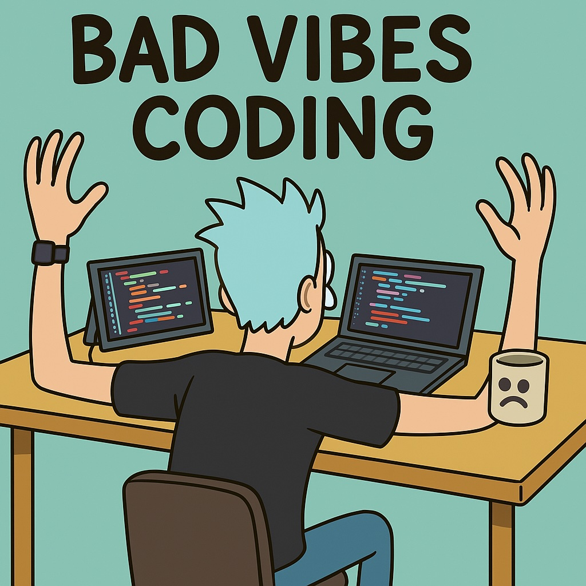

[Vibe coding](https://en.wikipedia.org/wiki/Vibe_coding) is a term [coined by Andrej Karpathy](https://x.com/karpathy/status/1886192184808149383) to describe when when we use AI to generate code, and go with the flow.

## My experience

"I mostly programmed in using English"

When GPT 4.5 first came out, I decided that instead of paying more for a Pro plan, I want to use via API.
And istead of using some existing chat interface, I will
A few prompts, and it worked like a charm - with some cool visuals for a terminal app.
Very likely, it was much faster that installing another

https://mathstodon.xyz/@pmigdal/114082123992099825

I felt like some sort of lazy tech enthusiast, until I have learned that

For me, programming brings intense emotions, flow, frustraion, joy, sense of accomplishment, and so on.

Vibe programming intensifies that - sometimes it creates a sense of breeze, when I can turn an idea into a working app in seconds. In other cases, it gives insense frustration.
The biggest upgrade to this [emotional rollercoaster was Claude 3.7 Sonnet](https://mathstodon.xyz/@pmigdal/114087340065429837). Sometimes it worked like a chart, othertimes, you ended up with 5 levels of nested yet unnecessary conditional, and code does not work.

## Questions

It feels like some kind of ChatGPT Roulette - you never know what you're gonna get.

- Will it show me let me discover a new library or intall needless depencencies?
- Will it refactor my code or spaghettigy it?
- Will it save me hours of work or waste it?
- Will it make a really nice UI or totally mess it up?
- Will it save me from a stuipid bug or introduce a new one?
- Will I be in the flow or in a vicious cycle?
- Will it make me feel like a genius or a fool?
- Will I pay \$20 for prompts to save me a day of hard work, or will I burn it?

I literally say "wow!" and "kur...!" (a traditional Polish expression of frustration) much more.

## Conclusion

Some people say that [real programmers](https://xkcd.com/378/) don't use AI. I don't believe that.

Others will say that I need let go the urge of control. It might work for mediation, but if you want to have code that solves something, you need some control.

The only think I have found constant is to find balance, when to use that, when not.
This balance changes, and changes rapidly.

We had new, cool JavaScript framework every year. Now we have new cool AI model every month.
