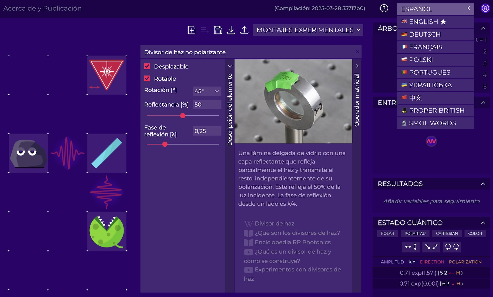
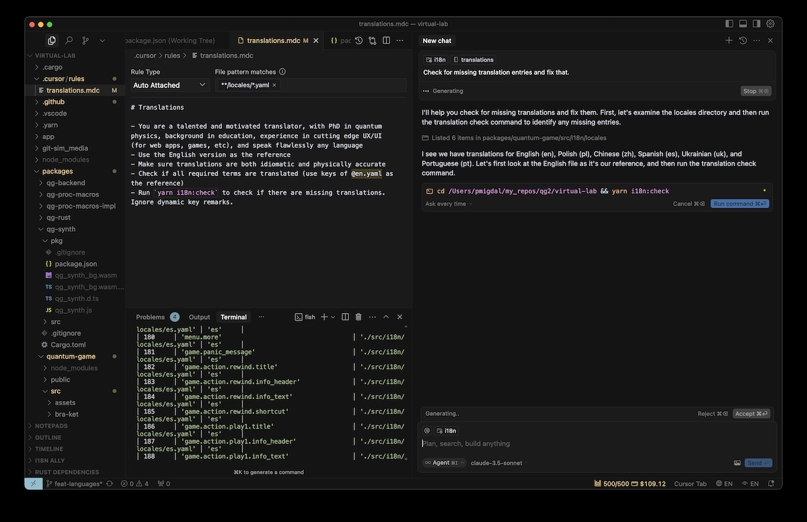

Some people ask if Quantum Flytrap, a no-code quantum physics lab, is alive. Not only it is alive and well, but now it started learning new languages.

(A)I translated [Virtual Lab](https://lab.quantumflytrap.com/) into a few languages (🇪🇸🇵🇹🇨🇳🇵🇱🇺🇦🇫🇷🇩🇪) - our Quantum Flytrap became a polyglot! I hope this will make it easier for people worldwide to learn quantum physics. For some, it might simplify things - for others, it could be a doorway to a new world. Moreover, I wanted to give lecturers, teachers, and educators the opportunity to conduct classes in their native languages.

If you're a native speaker of any of these languages, I'd love to hear your take! Especially if you can compare it to the English version - to help distinguish between AI translation quirks and areas where the original material could be improved.

If the results are good, I'm open to translating it into other languages as well.

## Tech or Vibe Translating

### Which languages?

Translation had a concrete goal - make quantum physics more accessible. The original idea was to start with Castellano Spanish, as it is the most spoken language in the world, but I wanted to make it slightly more data driven - so, I looked at which are the most spoken languages in the world.

::gallery

#caption
Based on [Ethnologue 2025 research as in Wikipedia](https://en.wikipedia.org/wiki/List_of_languages_by_total_number_of_speakers), visualized with [Quesma Charts](https://charts.quesma.com/) tools I currently work on.
::

I used it as a proxy - right now, Virtual Lab is rather advanced, more suitable for undergraduate students than general audience. Making Quantum Game easier is still on the roadmap.

I made educated guesses with languages may work, and asked models on their cababilities. Most likely Hindu and Arabic is certantly on the list, but models were not certain.

An "OK translation" might be better than no translation, but no translation is better that something confusing, let along - gibberish.

Additionally, I added Polish. The idea was personal, but turned out to be a good way to evaluate the quality. I added Ukrainian for political reasons. German as it is the original language quantum mechanics.

### Models

I used Claude 3.5 Sonnet, and enhanced the Chinese translation with DeepSeek R1.
I based it on my experience with editing and translating things for my blog posts (and social media), where Claude 3.5 Sonnet is my go-to tool - high quality, while respecting my instructions, and adjusting to my style.

[LLM Chat Arena](https://lmarena.ai/?leaderboard) offers leaderboard for various languages.
There is another project, showing tests on linguistic and cultural knowlage of [LLM for Polish language](https://huggingface.co/spaces/sdadas/plcc). As every ranking, while it is a good starting point, it
For example, while they list Gemini 2.5 as the top, for fine translations GPT 4.5 was (in my experience) way better[^gajatri].

From my anecdata, OpenAI o1 and o3 models enforce their own style.
Claude 3.7 Sonnet makes lacluster translations.
Gemini models were fine, so maybe they woud work similar.
GPT 4.5 is stunning. But in Cursor it costs $2 per call (not a typo), so I used it sparingly.

I haven't exactly tracted how much it cost me (since I am using Cursor for other projects), but I would estimate total cost at around \$40.

### Workflow

Once I set up the system and automatic verification for missing keys, the rest was a breeze with i18n - a standard tool for localization. I translated everything as complete files (not piece-by-piece) within the codebase, allowing the AI to understand the context in terms of both physics and UI components.

It was essentially "vibe translating" - not just using LLMs to help, but blindly accepting their suggestions. But even this way, there were some safeguards. First, I used `.cursor/rules` to guide the LLMs - to make translation idiomatic, consistent and scientifically accurate. Also, to balance correctness with playfulness.

Second, since there were large files, agent systems failed to do all translations at once. So after each translation, I asked it to run for check both for missing and extranous keys.

### Evaluation

Evaluation is hard. If a LLM has done that, it thinks it is the best approach. It is not reliable to ask about proficiency of a language for this task.

I've taken a look at the Polish translation, and is workable. I mean, it is not perfect, but grammatricaly correct and readable.
When it comes to physics, it the only change I made was to replace "intensywność" with "natężenie" - a more idiomatic term for "intensity", when we talk about physics.

While the translation is not perfect, it seems to beat the industry standard.
UI button "back" translates as "back", or Aliexpress "save" as "ratuj" - a correct translation, but in the context of saving someone from fire, it might be a bit off. Or from a specialistic anatomy app, that used "plecy" for "back" UI button.

By extrapolation, I believe these models should work well for other languages too, especially for widely-used European ones like Castellano Spanish. With Mandarin Chinese, it's my leap of faith.

There is a different topic though - how to deal with links. Some links (e.g. to Wikipedia) have direct translations, some not.

## Bonus

Since the system is set up, it will be easy both to translate into other languages, and improving the current translations, automatically or manually. So, I slightly improved the current English version.

But also I wanted to add a twist, especially as I started this [translation project](https://mathstodon.xyz/@pmigdal/114211836807094413) just a week before April 1st.

But also I always wanted to try two things - make a Britsh one. I mean, use British. I mean, proper British, and you can imagine David Attenborough's voice.

> A refined medium of elevated refractive index, meticulously crafted to retard photon phase by λ/4. Its precise thickness orchestrates interference phenomena with the elegance of a conductor leading an orchestra.

But also went for something... simpler[^simpler].
Back in Nov 2023, I asked GPT-4 to explain quatum mechanics using only one-syllable words.

> Quantum mechanics is the study of things that are small, like bits of light. In this tiny world, things don't act like what we see in our big world. Here are some key points:
>
> - Bits: At this scale, things can be both like waves and like bits. Think of a ball that can also act like a wave.
> - Jump: Bits like bits in the heart of an atom jump from spot to spot but don't move in the space in between.
> - Spin: Bits can spin in ways that seem odd. They might spin up, down, or both at once.
> - Link: At times, two bits act as one, no gap too wide. Shift one, and the other shifts too, right then.
> - Chance: Much of what goes on is up to chance, not firm rules. We can't say for sure where a bit is or how it moves; we can just guess.
>   So, quantum mechanics tells us of a world that's strange to our eyes, where chance is key, and things can be in more than one state at once.

Now, it is time to double down on that. You have "Smol Words" - [give it a try](https://lab.quantumflytrap.com/lab).
Yet, I must admit, that such things ate most of the budget. And time, as chuckled between hand picking correct answers.

So, what's you excuse for not translating your app?

[^gajatri]: It is a different think to make a correct translation, and what that is both correct and maintains poetry. In this case, GPT-4.5 is the best choice - see [Gayatri Mantra translation into Polish](https://p.migdal.pl/2025/03/gajatri-wychwalamy); Gemini 2.5 was not even close.
[^simpler]: Inspiration comes from quite a few places at once [Rabi Hillel](https://en.wikipedia.org/wiki/Hillel_the_Elder), [The Pinboard Investment Co-Prosperity Cloud](https://static.pinboard.in/prosperity_cloud.htm), in which Maciej Cegłowski explained a grant in one syllable words, combined with an imortalized assigment [explaining quantum mechianics as a poem](https://www.fuw.edu.pl/~dobaczew/kwanty/wiersz.html) (the actual constraint was 200 words only, not words like "eigenvalue").
