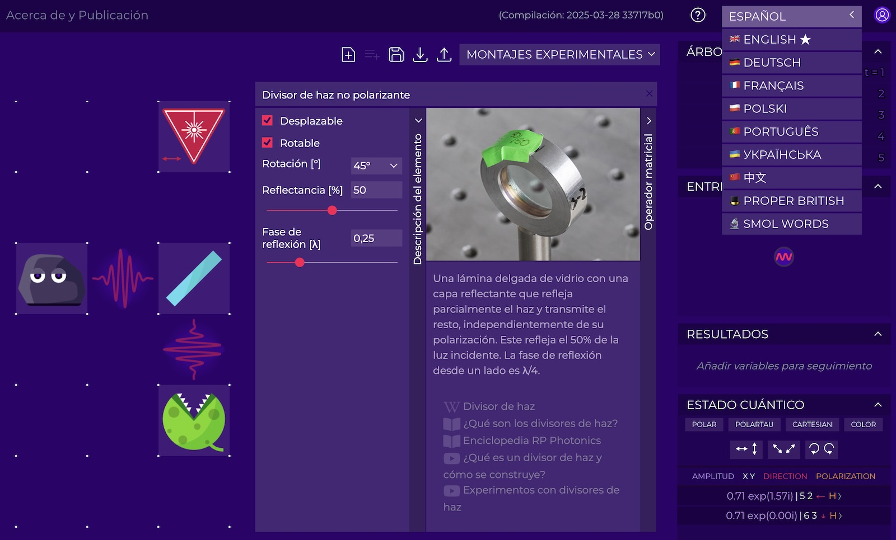
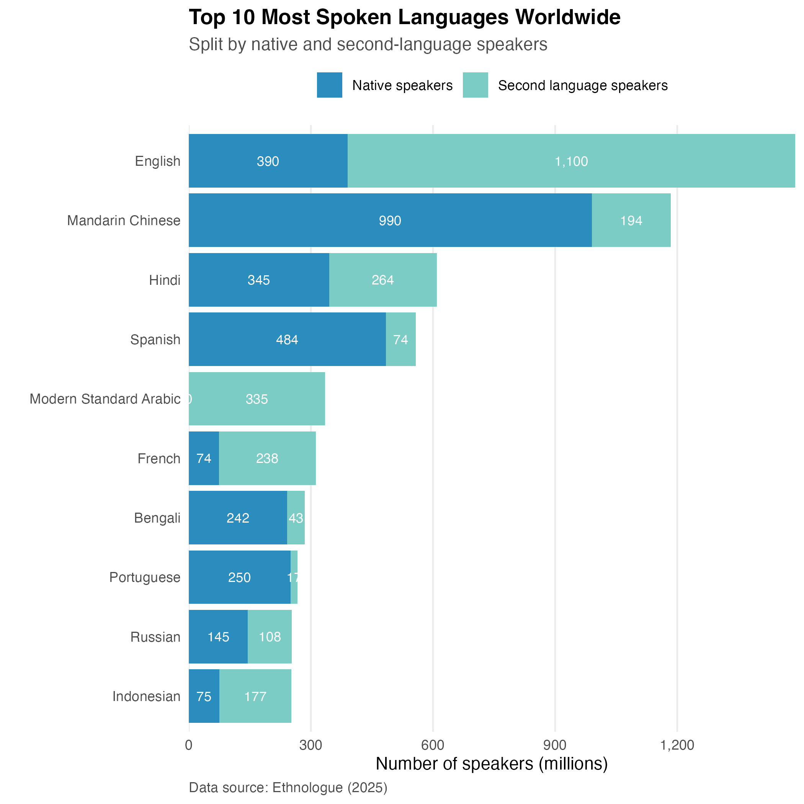

Some people ask if Quantum Flytrap, a no-code quantum physics lab, is alive. Not only is it alive and well, but now it has started learning new languages.

A(I) translated [Virtual Lab](https://lab.quantumflytrap.com/) into several languages (🇪🇸🇵🇹🇨🇳🇵🇱🇺🇦🇫🇷🇩🇪) — our Quantum Flytrap became a polyglot! I hope this makes quantum physics more accessible worldwide. For some, it might simplify things; for others, it could open a doorway to a new world. Moreover, I wanted to give lecturers, teachers, and educators the opportunity to conduct classes in their native languages.

If you're a native speaker of any of these languages, I'd love to hear your take! Especially if you can compare it to the English version — to help distinguish between AI translation quirks and areas where the original material could be improved.

If the results are good, I'm open to translating it into other languages as well.

## Technical details

### Which languages?

The translation had a concrete goal: making quantum physics more accessible. Initially, I planned to start with Castellano Spanish, as it's the most spoken language globally - and as I _entiendo español un poquito (pero no hablo mucho)_. However, I wanted to make the choice slightly more data-driven.

::gallery{ width = 1}
{width="100%"}
#caption
Based on [Ethnologue 2025 research as in Wikipedia](https://en.wikipedia.org/wiki/List_of_languages_by_total_number_of_speakers), visualized with [Quesma Charts](https://charts.quesma.com/) tools I currently work on. Just put your CSV, write a prompt, and get a chart.
::

I used worldwide speaker numbers as a proxy for potential reach, and made educated guesses about which languages might work and asked models about their capabilities. Hindi and Arabic are certainly on the list, but the models weren't entirely confident. An "OK translation" might be better than no translation, but no translation is preferable to something confusing — let alone gibberish.

While it is not in the top 10, I added Polish. The idea was personal but turned out to be a good way to evaluate quality. Ukrainian was included for political reasons, and German because it's [the original language of _Die Quantenmechanik_](https://en.wikipedia.org/wiki/History_of_quantum_mechanics).

### Models

I used Claude 3.5 Sonnet and enhanced the Chinese translation with DeepSeek R1. This choice was based on my experience editing and translating content for my blog posts (and social media), where Claude 3.5 Sonnet is my go-to tool — high quality, respectful of my instructions, and adaptable to my style.

[LLM Chat Arena](https://lmarena.ai/?leaderboard) offers a leaderboard for various languages. Another project tests linguistic and cultural knowledge of [LLMs for the Polish language](https://huggingface.co/spaces/sdadas/plcc). Like every ranking, it's a good starting point but not definitive. For example, while Gemini 2.5 tops their list, GPT 4.5 was, in my experience, far superior for nuanced translations[^gajatri].

From my anecdotal experience, OpenAI's o1 and o3 models enforce their own style. Claude 3.7 Sonnet, while in code ranging from [acing WebDev Arena](https://web.lmarena.ai/leaderboard) to [being an overeager intern](https://forum.cursor.com/t/max-mode-for-claude-3-7-out-now/65698), consistently produced translations I was not impressed by. Gemini models were fine, so perhaps they'd perform similarly to Claude 3.5 (or who knows, maybe better). GPT 4.5 is stunning, but in Cursor, it costs $2 per call (not a typo!), so I used it sparingly.

While GPT 4.5 remained my top choice overall, each model had its strengths. For capturing precise style and nuance, I found it valuable to generate multiple translations and either select the best one or combine the strongest elements from different versions.

I haven't precisely tracked the total cost (since I'm using Cursor for other projects), but I'd estimate it at around \$40, mostly eaten by the fun part.

### Workflow

Once I set up the system and automatic verification for missing keys, the rest was a breeze with [i18n](https://www.i18next.com/) — a standard localization tool. I translated everything as complete files (not piece-by-piece) within the codebase, allowing the AI to grasp the context in terms of both physics and UI components.

I call this approach **"vibe translating"** (similar to [vibe coding](https://en.wikipedia.org/wiki/Vibe_coding)) — not just using LLMs to help, but fully embracing their suggestions. For languages I don't understand (or even those I can partially read but not confidently evaluate), I have no choice but to trust the LLM and go with the flow. It's essentially "testing in production" - though unlike programming, where a missing semicolon can break everything, translation errors tend to be more forgiving.

Of course, I implemented safeguards. First, I used `.cursor/rules` to guide the LLMs, ensuring translations were idiomatic, consistent, scientifically accurate, and balanced correctness with playfulness.
Second, since the files were large, agent systems couldn't process all translations at once. After each translation, I ran checks for missing and extraneous keys, then repeated the process until completion.

### Evaluation

Evaluation is tricky. If an LLM has done something, it naturally believes it's the best approach. Asking about language proficiency for this task isn't reliable.

I've reviewed the Polish translation, and it's workable. It's not perfect, but grammatically correct and readable. Regarding physics, the only change I made was replacing "intensywność" with "natężenie" — a more idiomatic term for "intensity" in physics contexts.

While the translation isn't flawless, it seems to beat the industry standard. Consider UI Aliexpress' UI button "save" as "ratuj" (correct, but more suitable for rescuing someone from a fire) - which is still better than [this menu disaster](https://toppandigital.com/translation-blog/polish-restaurant-offers-cervical-cancer-on-menu-due-to-translation-error/).

Based on the Polish results, I extrapolated that these models should perform well for other languages too, especially widely-used European ones like Castellano Spanish. With Mandarin Chinese, I keep my fingers crossed.

### UX

Beyond language translation, I had to consider UI constraints and make several design decisions.

One key question was how to handle external links in element descriptions. While Wikipedia often had equivalent pages in other languages, finding quality translations for other sources proved challenging. LLMs sometimes tried to generate fictional links, so I had to be vigilant. For now, I've kept the original English links until I can implement automated link verification.

I also had to decide how to handle proper names. I chose to translate "Quantum Game" to make it more accessible, while keeping "Quantum Flytrap" as a brand name (with a few playful exceptions).

## Bonus

Since the system is set up, translating into additional languages or improving current translations (automatically or manually) will be straightforward. Thus, I slightly improved the current English version.

But I also wanted to add a twist, especially since I started this [translation project](https://mathstodon.xyz/@pmigdal/114211836807094413) just a week before April 1st.

Moreover, I've always wanted to try two things. First, creating a British version. I mean, proper British — imagine David Attenborough's voice:

> A refined medium of elevated refractive index, meticulously crafted to retard photon phase by λ/4. Its precise thickness orchestrates interference phenomena with the elegance of a conductor leading an orchestra.

Second, something... simpler[^simpler]. Back in Nov 2023, I asked GPT-4 to explain quantum mechanics using only one-syllable words:

> Quantum mechanics is the study of things that are small, like bits of light. In this tiny world, things don't act like what we see in our big world. Here are some key points:
>
> - Bits: At this scale, things can be both like waves and like bits. Think of a ball that can also act like a wave.
> - Jump: Bits like bits in the heart of an atom jump from spot to spot but don't move in the space in between.
> - Spin: Bits can spin in ways that seem odd. They might spin up, down, or both at once.
> - Link: At times, two bits act as one, no gap too wide. Shift one, and the other shifts too, right then.
> - Chance: Much of what goes on is up to chance, not firm rules. We can't say for sure where a bit is or how it moves; we can just guess.
>
> So, quantum mechanics tells us of a world that's strange to our eyes, where chance is key, and things can be in more than one state at once.

Now, it's time to double down on that. You have "Smol Words" — [give it a try](https://lab.quantumflytrap.com/lab). Yet, I must admit, such experiments consumed most of the budget. And time, as I chuckled between hand-picking correct answers.

Do you want to see Quantum Flytrap in your language?

So, what's your excuse for not translating your app?

[^gajatri]: It's one thing to make a correct translation, another to maintain poetic quality. GPT-4.5 excels here — see [Gayatri Mantra translation into Polish](https://p.migdal.pl/2025/03/gajatri-wychwalamy); Gemini 2.5 wasn't even close.
[^simpler]: Inspiration comes diverse places - [xkcd](https://xkcd.com/), [Hillel](https://en.wikipedia.org/wiki/Hillel_the_Elder), [a link baron's minimalistic investment scheme](https://static.pinboard.in/prosperity_cloud.htm), and a [short poem](https://www.fuw.edu.pl/~dobaczew/kwanty/wiersz.html) which was sent solution to QM101 assigment "explain quantum mechanics in 200 words"
