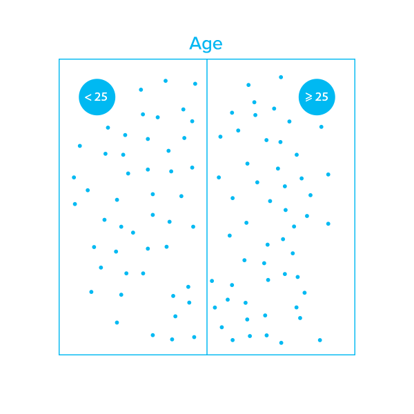
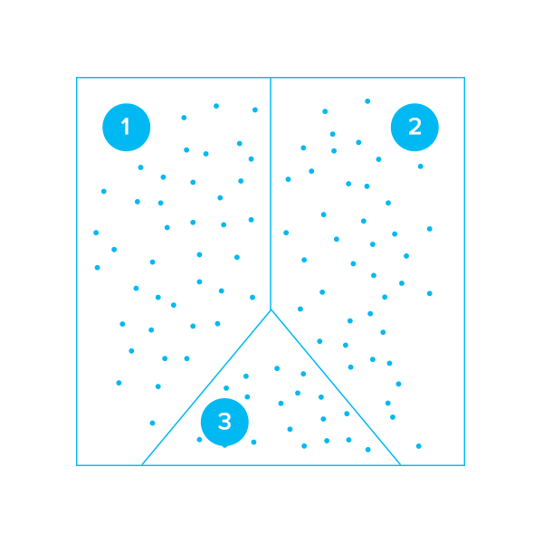
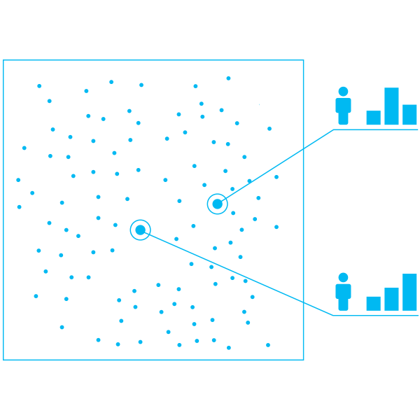

Every time you watch a film Netflix has suggested or buy a "similar product" on Amazon, it is a personalized recommendation. Can you make such recommendations work for your business as well?

Currently there are four levels of advancement in customer targeting, from no segmentation at all to advanced recommendation systems.

1. **No segmentation at all** – targeting all potential customers the same way
2. **Manual segmentation** – the most intuitive technique, the segmentation being done by human analysts
3. **Automated segmentation** – using machine learning to segment datasets and look for hidden patterns
4. **Recommendation systems** – instead of building a limited number of segments, these systems build an individual representation of each customer and product

Each of the four approaches has unique benefits.

### 1. No segmentation

In the age of the Internet, treating all customers as a homogenous group will nick your popularity. This is why [83% of companies use at least a basic form of segmentation](https://www.hubspot.com/marketing-statistics) in their daily business. On the other hand, [43% of marketers don't send targeted emails](https://www.hubspot.com/marketing-statistics).

Sometimes it is just not necessary to do so. If the business is a highly specialized or niche one or involves companies with few customers, further segmentation would not provide a significant return.

- _When an online bookstore sells only legal publications, there is usually no need to segment customers, as only lawyers or professionals may need such books._

The need for segmentation grows alongside the scale of the business, as even with the most narrow segment customers are not a homogenous group and their needs may differ.

**Benefits:**

- Simple and cheap
- Effective at the beginning, when there are few customers
- No costs to maintain or implement

**Drawbacks:**

- Ineffective at larger scale
- Inflexible
- Lost opportunities resulting in low effectiveness

**Who can benefit:**

- Small companies with few customers or companies with a narrow target group and high specialization

### 2. Manual customer segmentation

Human analysts using tools of varying degrees of complication can handle segmentation manually: from Excel sheets to Tableau and advanced Business Intelligence tools. The analysts usually look at intuitive segments, for example demographic divisions (age, gender) and other criteria including geography, income, total purchase value or other factors.

- _An online bookstore selling popular literature could segment readers into three groups: youth, women and men, each of whom obviously have their own preferences._

Even with all the benefits that attend building groups of customers, doing it manually presents significant challenges:

- Analysts processing the data may be biased. Teenage boys are stereotyped as computer gamers, but [mature women play computer games more than young boys](https://www.usnews.com/news/articles/2014/08/25/study-adult-women-gamers-outnumber-teenage-boys).
- With the dynamic nature of the market, every manual segmentation quickly becomes outdated. Then the work needs to be redone – again manually.
- The number of groups and segments researchers can create, validate and maintain is limited.
- Manual segmentation is not scalable

Even considering all the challenges the manual customer segmentation comes with, it is still a powerful efficiency boosting tool. For many companies, including most small businesses, manual segmentation is just enough.

**Benefits:**

- Intuitive and simple
- Greater efficiency than no segmentation at all
- Transparent and easy to understand

**Drawbacks:**

- Not scalable
- Fairly inflexible
- Requires constant maintenance, updates and supervision by human analysts

**Who can benefit:**

- Small, middle and sometimes large companies with easily segmented customer groups, including companies selling products tailored for demographics or using other straightforward criteria to target customers

### 3. Automatic segmentation done with machine learning

Machine learning can be used to predict behaviour such as affinity for a given product or churn probability. However, this approach becomes slightly more challenging if you want to cluster similar customers, when there is no "ground truth".

K-means and hierarchical aggregation are currently the most widely used algorithms to cluster datasets without human supervision. Each point (customers in the dataset) is assigned to a class. Leaving behind the limited perception of the human researcher, including hidden biases and presuppositions, these algorithms can spot the most obscure and surprising and least obvious clusters within the dataset.

- In k-means, the number of clusters is fixed and the algorithm finds neighbouring points accordingly, as explained in this [visualization](https://www.naftaliharris.com/blog/visualizing-k-means-clustering/).
- [Hierarchical aggregation](https://dashee87.github.io/data%20science/general/Clustering-with-Scikit-with-GIFs/) is an array of techniques that connect neighbouring points step-by-step, forming a dendrogram. While the algorithm provides more flexibility (we can set the number of clusters post factum), it requires stricter supervision and the clustering may be less stable.

One double take-inducing example comes from a man who used clustering to find the [perfect woman for him from OkCupid's database](https://www.wired.com/2014/01/how-to-hack-okcupid/). Such inspiring applications aside, using algorithms to segment datasets will present a number of challenges:

- Clustering is done on all data, both the useful and the irrelevant (e.g. hair color and complexion may be useful for shampoos but useless for taste in films)
- There is a fixed number of clusters. Although there are heuristics [designed to tackle the problem](https://kkulma.github.io/2017-04-24-determining-optimal-number-of-clusters-in-your-data/), it remains an arbitrary choice. Clustering puts everyone in a distinct group, but there are surely more than 50 shades of grey between black and white.
  - Establishing a sharp line between readers of fiction and non-fiction books is every bit as hard as distinguishing between pure high-fantasy lovers and hard science fiction readers.
- Usually there is an actionable interpretation only for some groups.

It is therefore sometimes better to treat every customer individually instead of building groups and trying to find which group is the best fit. That's the bedrock of recommendation systems.

**Benefits:**

- Finds hidden clusters within the dataset
- Automated and therefore has no presuppositions
- Easier to scale and maintain productivity

**Drawbacks:**

- Requires human supervision, further interpretation of the segments, may produce segments that make no sense
- Requires maintenance and updates

**Who can benefit:**

- Larger organizations with too much data to handle manually

### 4. Recommendation systems

Instead of seeking groups within a dataset, recommendation engines provide the customer with a representation in the form of a multidimensional vector (much like [word2vec for discovering word similarities and analogies](https://p.migdal.pl/2017/01/king-man-woman-queen-why)). It shows how the customer is perceived in terms of inferred (not chosen!) factors:

- How much do our book readers like fiction or non-fiction books?
- What's their attitude to fantasy and science fiction novels?
- How do they feel about romantic, dramatic and action-packed plots?
- What is the writer's political affiliation?

Modern recommendation systems, such as [Factorization Machines](https://www.reddit.com/r/MachineLearning/comments/65d3lt/r_factorization_machines_2010_a_classic_paper_in/), are able to leverage both official data (the author, genre, date of publication) and less obvious information inferred from buying patterns (are there any fictional monsters in the plot?, are there any supernatural horror elements?)

- _If the reader likes political fiction, is slightly interested in science fiction and loves dramatic stories, he would probably be keen to read Margaret Atwood's "The Handmaid's Tale"_

Assigning vectors to both customers and products allows the company to build narrow segments within segments and launch precisely targeted marketing campaigns.

- _Instead of "fiction weekend", the online bookstore targeted narrow segments with the books individuals in a given group prefer. The group of fantasy novel readers got information about "high fantasy weekend" and selected 10 books that may be the most interesting for them._

We can take things even a step further, showcasing not only similar products, but analogous ones too – for example, [a maternity version of a dress a client likes](https://multithreaded.stitchfix.com/blog/2015/03/11/word-is-worth-a-thousand-vectors/).

The recommendation systems also work with datasets that are not fully covered. No one reads all the books that are published. But a dozen books may be enough to predict what a person will like.

Using vector representation makes it is easier to validate if the system is working properly – every purchase is a feedback and may be used to readjust the model.

**Benefits:**

- Every customer is treated individually
- Constantly updated and evaluated
- Scalable

**Drawbacks:**

- Requires vast amounts of data to work properly
- The technology is complicated and requires skilled data scientists

**Who can benefit:**

- Large organizations with data-oriented culture, which process great amounts of data and are able to leverage the system.

## Summary

While recommendation systems are more flexible and sophisticated than segmentation, the tools a company should use must be suited to the type of business they do and the challenges they have to be solved. Machine learning is not a magic problem solver to provide a company with out-of-box solutions that work everywhere. But where the scale, variety and complexity of datasets are overwhelming for human data scientists, ML is the best tool available.
